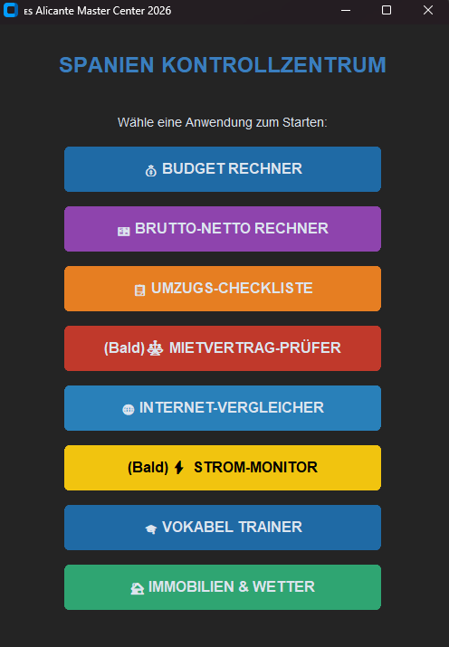

🌟 Kern-Features
Das Master Center ist als modulares Dashboard konzipiert. Mit einem Klick startest du spezialisierte Tools:
🏠 Wohnen & Leben
Real Estate Scraper: Durchsucht Idealista live nach Wohnungen in San Juan d'Alacant und Alicante.
Wetter-Monitor: Aktuelle Wetterdaten via OpenWeatherMap API für deine Zielregion.
Internet-Check: Vergleich lokaler Anbieter für Glasfaser (Fibra).
🎓 Sprache & Bildung
Vokabel-Trainer: Systematisches Lernen von Vokabeln und Sätzen mit Fortschrittsspeicherung.
Offline Verb-Konjugator: (Beta) Konjugiert spanische Verben direkt auf deinem PC ohne Internetverbindung.
💶 Finanzen & Bürokratie
Budget Rechner: Detaillierte Kalkulation der Lebenshaltungskosten.
Brutto-Netto Check: Schätzung des Netto-Gehalts nach spanischem Steuerrecht.
Umzugs-Checkliste: Dynamische Liste für Meilensteine wie NIE, Empadronamiento und Autozulassung.
🛠️ Installation & Setup
Repository klonen:
bash
git clone https://github.com
cd Spanien-Auswanderung
Verwende Code mit Vorsicht.
Abhängigkeiten installieren:
bash
pip install customtkinter requests selenium webdriver-manager verbecc
Verwende Code mit Vorsicht.
Chrome Driver:
Der Immobilien-Scraper nutzt Selenium. Stelle sicher, dass Google Chrome installiert ist (der webdriver-manager kümmert sich um den Rest).

Verwende Code mit Vorsicht.
🚀 Ausführung
Starte einfach die Hauptdatei, um das Kontrollzentrum zu öffnen:
bash
python main_center.py
Verwende Code mit Vorsicht.
📈 Roadmap 2026
AI-Contract-Check: Automatisierte Prüfung von spanischen Mietverträgen.
Energy-Monitor: Integration der tagesaktuellen Strompreise (PVPC).
Mobile-Sync: Export der Einkaufslisten auf das Smartphone.
👨‍💻 Über das Projekt
Dieses Projekt entstand aus der Vorbereitung auf ein neues Kapitel in Spanien. Es kombiniert Automatisierung mit praktischem Nutzen für Expats und digitale Nomaden.
Noah – Future Resident of Alicante 🌴

